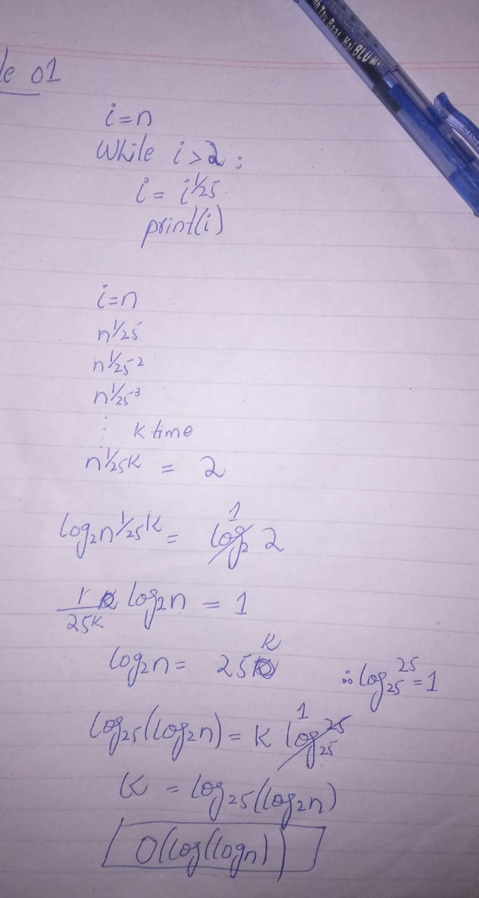
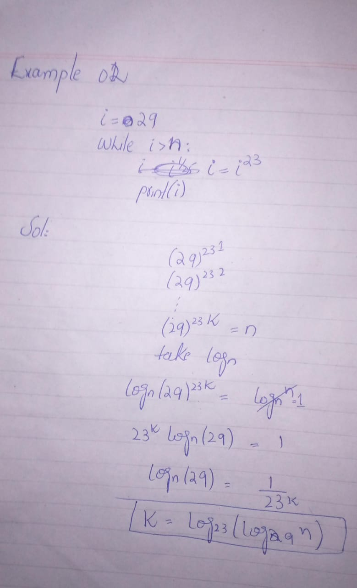
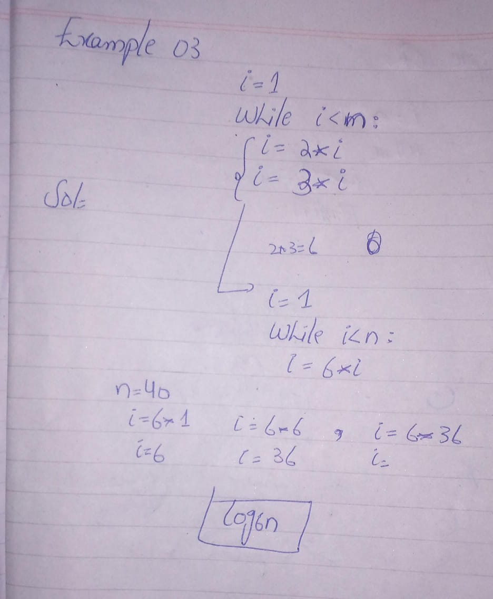

# Apriori Analysis

This readme.md file contains the analysis of three different code examples and their complexity.

## Example 1: Halving and Printing

```python
i = n
while i >= 1:
    i = i^1/25
    print(i)
```    


    
## Example 2: 

```python
i = 29
while i < m:
    i = i^23

```


## Example 3: Doubling and Tripling

```python
i = 1
while i < n:
    i = 2 * i
    i = 3 * i

```
0(log₆n)
